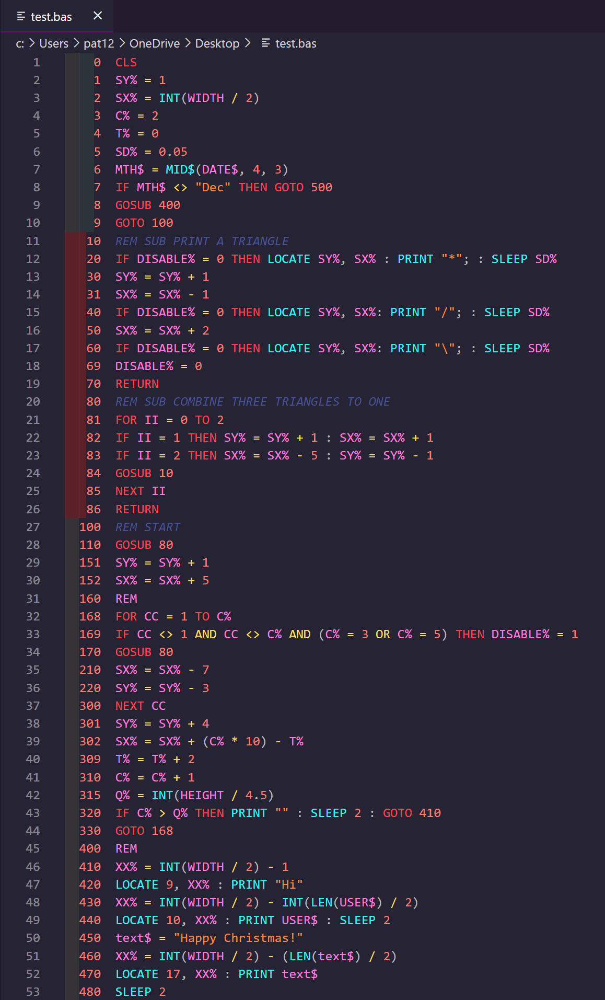

# Telehack BASIC Syntax Highlighting Extension

This Extension enables Syntax Highlighting for the [Telehack BASIC Language](https://raw.githubusercontent.com/p85/basic.man/master/basic.man).

 

You can install it from the VSCode Appstore. Search for `Telehack`

Or install it from the Commandline:

`code --install-extension vscode-th-basic.vscode-th-basic`

 

